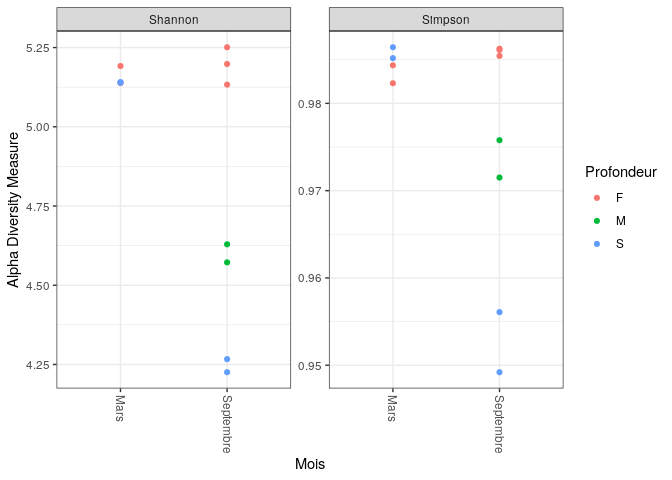
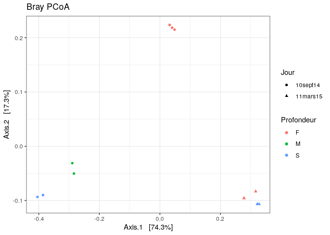
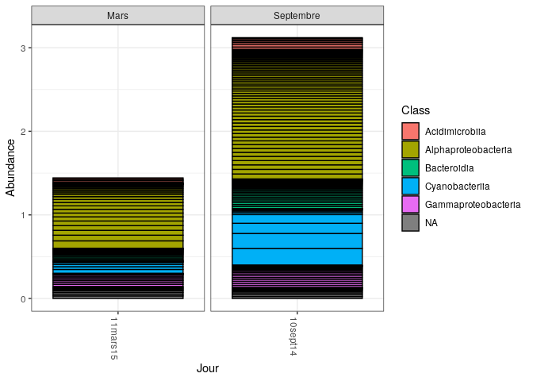

CC2 Rade De Brest
================
Mrozinski Alexandre

``` r
knitr::opts_chunk$set(echo=TRUE, eval=TRUE)
```

``` bash
wget pagesperso.univ-brest.fr/~maignien/teaching/M1-MFA/UE-Ecogenomique2/EcoG2_data_cc2.tar.gz
tar xzvf EcoG2_data_cc2.tar.gz
```

``` bash
mkdir data
mv St_Stratif_11mars15/Station* data
mv St_Stratif_10sept14/Station* data

rm -d St_Stratif_11mars15 
rm -d St_Stratif_10sept14 
rm EcoG2_data_cc2.tar.gz
```

``` r
path <- "data"
```

``` r
list.files(path)
```

    ##  [1] "filtered"                            "Station5_Fond1_10sept14_R1.fastq"   
    ##  [3] "Station5_Fond1_10sept14_R2.fastq"    "Station5_Fond1_11mars15_R1.fastq"   
    ##  [5] "Station5_Fond1_11mars15_R2.fastq"    "Station5_Fond2_10sept14_R1.fastq"   
    ##  [7] "Station5_Fond2_10sept14_R2.fastq"    "Station5_Fond2_11mars15_R1.fastq"   
    ##  [9] "Station5_Fond2_11mars15_R2.fastq"    "Station5_Fond3_10sept14_R1.fastq"   
    ## [11] "Station5_Fond3_10sept14_R2.fastq"    "Station5_Median1_10sept14_R1.fastq" 
    ## [13] "Station5_Median1_10sept14_R2.fastq"  "Station5_Median2_10sept14_R1.fastq" 
    ## [15] "Station5_Median2_10sept14_R2.fastq"  "Station5_Surface1_10sept14_R1.fastq"
    ## [17] "Station5_Surface1_10sept14_R2.fastq" "Station5_Surface1_11mars15_R1.fastq"
    ## [19] "Station5_Surface1_11mars15_R2.fastq" "Station5_Surface2_10sept14_R1.fastq"
    ## [21] "Station5_Surface2_10sept14_R2.fastq" "Station5_Surface2_11mars15_R1.fastq"
    ## [23] "Station5_Surface2_11mars15_R2.fastq"

``` r
fnFs <- sort(list.files(path, pattern="_R1", full.names = TRUE))
fnRs <- sort(list.files(path, pattern="_R2", full.names = TRUE))

sample.names <- sapply(strsplit(basename(fnFs), "_R"), `[`, 1)
```

``` r
plotQualityProfile(fnRs[1:2])
```

    ## Warning: `guides(<scale> = FALSE)` is deprecated. Please use `guides(<scale> =
    ## "none")` instead.

<!-- -->

``` r
plotQualityProfile(fnFs[1:2])
```

    ## Warning: `guides(<scale> = FALSE)` is deprecated. Please use `guides(<scale> =
    ## "none")` instead.

<!-- -->

# Filter and trim

``` r
filtFs <- file.path(path, "filtered", paste0(sample.names, "_F_filt.fastq.gz"))
filtRs <- file.path(path, "filtered", paste0(sample.names, "_R_filt.fastq.gz"))
names(filtFs) <- sample.names
names(filtRs) <- sample.names
```

``` r
out <- filterAndTrim(fnFs, filtFs, fnRs, filtRs, truncLen=c(245,230), trimLeft=c(18,18),
              maxN=0, maxEE=c(2,2), truncQ=2, rm.phix=TRUE,
              compress=TRUE, multithread=TRUE)
head(out)
```

    ##                                    reads.in reads.out
    ## Station5_Fond1_10sept14_R1.fastq     159971    137589
    ## Station5_Fond1_11mars15_R1.fastq     175993    152411
    ## Station5_Fond2_10sept14_R1.fastq     197039    167174
    ## Station5_Fond2_11mars15_R1.fastq      87585     75973
    ## Station5_Fond3_10sept14_R1.fastq     117140    100533
    ## Station5_Median1_10sept14_R1.fastq   116519    101677

### Amorces de 18pb, nécessité de garder 430 pb minimum pour l’analyse. Nous avons ici 439 restantes, en retirant les amorces (18) et en coupant a 245 pour R1, et 230 pour R2.

# Learn the Error Rates

``` r
errFs <- learnErrors(filtFs, multithread=TRUE)
```

    ## 103778498 total bases in 457174 reads from 3 samples will be used for learning the error rates.

``` r
errRs <- learnErrors(filtRs, multithread=TRUE)
```

    ## 113027164 total bases in 533147 reads from 4 samples will be used for learning the error rates.

``` r
plotErrors(errFs, nominalQ=TRUE)
```

    ## Warning: Transformation introduced infinite values in continuous y-axis
    ## Transformation introduced infinite values in continuous y-axis

<!-- -->

``` r
plotErrors(errRs, nominalQ=TRUE)
```

    ## Warning: Transformation introduced infinite values in continuous y-axis
    ## Transformation introduced infinite values in continuous y-axis

<!-- -->

# Sample Inference

``` r
dadaFs <- dada(filtFs, err=errFs, multithread=TRUE)
```

    ## Sample 1 - 137589 reads in 35553 unique sequences.
    ## Sample 2 - 152411 reads in 33585 unique sequences.
    ## Sample 3 - 167174 reads in 44206 unique sequences.
    ## Sample 4 - 75973 reads in 19134 unique sequences.
    ## Sample 5 - 100533 reads in 28469 unique sequences.
    ## Sample 6 - 101677 reads in 27087 unique sequences.
    ## Sample 7 - 94105 reads in 24203 unique sequences.
    ## Sample 8 - 102722 reads in 25221 unique sequences.
    ## Sample 9 - 67381 reads in 16862 unique sequences.
    ## Sample 10 - 74319 reads in 18932 unique sequences.
    ## Sample 11 - 86793 reads in 23141 unique sequences.

``` r
dadaRs <- dada(filtRs, err=errRs, multithread=TRUE)
```

    ## Sample 1 - 137589 reads in 53646 unique sequences.
    ## Sample 2 - 152411 reads in 49871 unique sequences.
    ## Sample 3 - 167174 reads in 65326 unique sequences.
    ## Sample 4 - 75973 reads in 27704 unique sequences.
    ## Sample 5 - 100533 reads in 40854 unique sequences.
    ## Sample 6 - 101677 reads in 37985 unique sequences.
    ## Sample 7 - 94105 reads in 34797 unique sequences.
    ## Sample 8 - 102722 reads in 35516 unique sequences.
    ## Sample 9 - 67381 reads in 25441 unique sequences.
    ## Sample 10 - 74319 reads in 26512 unique sequences.
    ## Sample 11 - 86793 reads in 33797 unique sequences.

``` r
dadaFs[[1]]
```

    ## dada-class: object describing DADA2 denoising results
    ## 997 sequence variants were inferred from 35553 input unique sequences.
    ## Key parameters: OMEGA_A = 1e-40, OMEGA_C = 1e-40, BAND_SIZE = 16

``` r
dadaRs[[1]]
```

    ## dada-class: object describing DADA2 denoising results
    ## 889 sequence variants were inferred from 53646 input unique sequences.
    ## Key parameters: OMEGA_A = 1e-40, OMEGA_C = 1e-40, BAND_SIZE = 16

# Merge paired reads

``` r
mergers <- mergePairs(dadaFs, filtFs, dadaRs, filtRs, verbose=TRUE)
```

    ## 108252 paired-reads (in 3622 unique pairings) successfully merged out of 130992 (in 17658 pairings) input.

    ## 129276 paired-reads (in 2945 unique pairings) successfully merged out of 147238 (in 13354 pairings) input.

    ## 130991 paired-reads (in 4974 unique pairings) successfully merged out of 159357 (in 22686 pairings) input.

    ## 61817 paired-reads (in 1706 unique pairings) successfully merged out of 72417 (in 7945 pairings) input.

    ## 77077 paired-reads (in 2435 unique pairings) successfully merged out of 94981 (in 13338 pairings) input.

    ## 80817 paired-reads (in 2520 unique pairings) successfully merged out of 97184 (in 11993 pairings) input.

    ## 75703 paired-reads (in 1971 unique pairings) successfully merged out of 89808 (in 10184 pairings) input.

    ## 84011 paired-reads (in 2282 unique pairings) successfully merged out of 98643 (in 10394 pairings) input.

    ## 54976 paired-reads (in 1295 unique pairings) successfully merged out of 63998 (in 6459 pairings) input.

    ## 61806 paired-reads (in 1388 unique pairings) successfully merged out of 71629 (in 6984 pairings) input.

    ## 68250 paired-reads (in 2016 unique pairings) successfully merged out of 82358 (in 10099 pairings) input.

``` r
head(mergers[[1]])
```

    ##                                                                                                                                                                                                                                                                                                                                                                                         sequence
    ## 1        TAATACGAAGGGACCTAGCGTAGTTCGGAATTACTGGGCTTAAAGAGTTCGTAGGTGGTTGAAAAAGTTAGTGGTGAAATCCCAGAGCTTAACTCTGGAACTGCCATTAAAACTTTTCAGCTAGAGTATGATAGAGGAAAGCAGAATTTCTAGTGTAGAGGTGAAATTCGTAGATATTAGAAAGAATACCAATTGCGAAGGCAGCTTTCTGGATCATTACTGACACTGAGGAACGAAAGCATGGGTAGCGAAGAGGATTAGATACCCTCGTAGTCCATGCCGTAAACGATGTGTGTTAGACGTTGGAAATTTATTTTCAGTGTCGCAGGGAAACCGATAAACACACCGCCTGGGGAGTACGACCGCAAGGTTAAA
    ## 2        TAATACGAAGGGACCTAGCGTAGTTCGGAATTACTGGGCTTAAAGAGTTCGTAGGTGGTTGAAAAAGTTGGTGGTGAAATCCCAGAGCTTAACTCTGGAACTGCCATCAAAACTTTTCAGCTAGAGTATGATAGAGGAAAGCAGAATTTCTAGTGTAGAGGTGAAATTCGTAGATATTAGAAAGAATACCAATTGCGAAGGCAGCTTTCTGGATCATTACTGACACTGAGGAACGAAAGCATGGGTAGCGAAGAGGATTAGATACCCTCGTAGTCCATGCCGTAAACGATGTGTGTTAGACGTTGGAAATTTATTTTCAGTGTCGCAGCGAAAGCGATAAACACACCGCCTGGGGAGTACGACCGCAAGGTTAAA
    ## 3        TAATACGAAGGGACCTAGCGTAGTTCGGAATTACTGGGCTTAAAGAGTTCGTAGGTGGTTGAAAAAGTTGGTGGTGAAATCCCAGAGCTTAACTCTGGAACTGCCATCAAAACTTTTCAGCTAGAGTTTGATAGAGGAAAGCAGAATTTCTAGTGTAGAGGTGAAATTCGTAGATATTAGAAAGAATACCAATTGCGAAGGCAGCTTTCTGGATCATTACTGACACTGAGGAACGAAAGCATGGGTAGCGAAGAGGATTAGATACCCTCGTAGTCCATGCCGTAAACGATGTGTGTTAGACGTTGGAAATTTATTTTCAGTGTCGCAGCGAAAGCGATAAACACACCGCCTGGGGAGTACGACCGCAAGGTTAAA
    ## 4        TAATACGAAGGGACCTAGCGTAGTTCGGAATTACTGGGCTTAAAGAGTTCGTAGGTGGTTGAAAAAGTTAGTGGTGAAATCCCAGAGCTTAACTCTGGAACTGCCATTAAAACTTTTCAGCTAGAGTATGATAGAGGAAAGCAGAATTTCTAGTGTAGAGGTGAAATTCGTAGATATTAGAAAGAATACCAATTGCGAAGGCAGCTTTCTGGATCATTACTGACACTGAGGAACGAAAGCATGGGTAGCGAAGAGGATTAGATACCCTCGTAGTCCATGCCGTAAACGATGTGTGTTAGACGTTGGAAATTTATTTTCAGTGTCGCAGCGAAAGCGATAAACACACCGCCTGGGGAGTACGACCGCAAGGTTAAA
    ## 5        TAATACGAAGGGACCTAGCGTAGTTCGGAATTACTGGGCTTAAAGAGTTCGTAGGTGGTTGAAAAAGTTGGTGGTGAAATCCCAGAGCTTAACTCTGGAACTGCCATCAAAACTTTTCAGCTAGAGTATGATAGAGGAAAGCAGAATTTCTAGTGTAGAGGTGAAATTCGTAGATATTAGAAAGAATACCAATTGCGAAGGCAGCTTTCTGGATCATTACTGACACTGAGGAACGAAAGCATGGGTAGCGAAGAGGATTAGATACCCTCGTAGTCCATGCCGTAAACGATGTGTGTTAGACGTTGGAAATTTATTTTCAGTGTCGCAGGGAAACCGATAAACACACCGCCTGGGGAGTACGACCGCAAGGTTAAA
    ## 6 TAATACATAGGGGTCAAGCGTTGTCCGGATTTATTGGGCGTAAAGAGCTCGTAGGCGGTTCAACAAGTCGGTCGTAAAAGTTTAGGGCTCAACCCTAAAATGTCGATCGATACTGTTGTGACTAGGATACGGTAGAGGTGAATGGAATTCCGAGTGTAGCGGTGAAATGCGTAGATATTCGGAGGAACACCAATTGCGAAGGCAGTTCACTGGACCGTGATCGACGCTGAGGAGCGAAAGCTAGGGGAGCAAACAGGATTAGATACCCTGGTAGTCCTAGCTGTAAACGATGGATACTAGATGTAGGAACTGGATTGACGGTTTCTGTATCGTAGCTAACGCGTTAAGTATCCCGCCTGGGGAGTACGGTCGCAAGACTAAA
    ##   abundance forward reverse nmatch nmismatch nindel prefer accept
    ## 1      5013       1       2     64         0      0      1   TRUE
    ## 2      4013       2       1     64         0      0      2   TRUE
    ## 3      3664       3       1     64         0      0      2   TRUE
    ## 4      2414       1       1     64         0      0      2   TRUE
    ## 5      2167       2       2     64         0      0      2   TRUE
    ## 6      2109      11       4     57         0      0      1   TRUE

# Construct sequence table

``` r
seqtab <- makeSequenceTable(mergers)
dim(seqtab)
```

    ## [1]    11 13780

``` r
table(nchar(getSequences(seqtab)))
```

    ## 
    ##  358  359  369  370  371  372  373  374  375  376  377  378  379  380  381  382 
    ##    2    1    1    4  155   25  112  132 3801 1932 1661 2037 2301   81 1446   68 
    ##  383  384  388  392  393  395  398  403  404  412  415 
    ##    5    1    1    2    1    1    3    3    2    1    1

# Remove chimeras

``` r
seqtab.nochim <- removeBimeraDenovo(seqtab, method="consensus", multithread=TRUE, verbose=TRUE)
```

    ## Identified 12356 bimeras out of 13780 input sequences.

``` r
dim(seqtab.nochim)
```

    ## [1]   11 1424

``` r
sum(seqtab.nochim)/sum(seqtab)
```

    ## [1] 0.7929904

# Track reads through the pipeline

``` r
getN <- function(x) sum(getUniques(x))
track <- cbind(out, sapply(dadaFs, getN), sapply(dadaRs, getN), sapply(mergers, getN), rowSums(seqtab.nochim))

colnames(track) <- c("input", "filtered", "denoisedF", "denoisedR", "merged", "nonchim")
rownames(track) <- sample.names
head(track)
```

    ##                            input filtered denoisedF denoisedR merged nonchim
    ## Station5_Fond1_10sept14   159971   137589    134650    133587 108252   82677
    ## Station5_Fond1_11mars15   175993   152411    149805    149455 129276  105667
    ## Station5_Fond2_10sept14   197039   167174    163361    162781 130991   97535
    ## Station5_Fond2_11mars15    87585    75973     74373     73747  61817   51605
    ## Station5_Fond3_10sept14   117140   100533     97941     97210  77077   60361
    ## Station5_Median1_10sept14 116519   101677     99649     99000  80817   62719

# Assign taxonomy

``` bash
wget https://zenodo.org/record/4587955/files/silva_nr99_v138.1_train_set.fa.gz?download=1
```

``` r
taxa <- assignTaxonomy(seqtab.nochim, "silva_nr99_v138.1_train_set.fa.gz?download=1", multithread=TRUE)
```

``` r
taxa.print <- taxa 
rownames(taxa.print) <- NULL
head(taxa.print)
```

    ##      Kingdom    Phylum             Class                 Order            
    ## [1,] "Bacteria" "Proteobacteria"   "Alphaproteobacteria" "SAR11 clade"    
    ## [2,] "Bacteria" "Cyanobacteria"    "Cyanobacteriia"      "Synechococcales"
    ## [3,] "Bacteria" "Proteobacteria"   "Alphaproteobacteria" "SAR11 clade"    
    ## [4,] "Bacteria" "Proteobacteria"   "Alphaproteobacteria" "SAR11 clade"    
    ## [5,] "Bacteria" "Proteobacteria"   "Alphaproteobacteria" "SAR11 clade"    
    ## [6,] "Bacteria" "Actinobacteriota" "Acidimicrobiia"      "Actinomarinales"
    ##      Family             Genus                    
    ## [1,] "Clade I"          "Clade Ia"               
    ## [2,] "Cyanobiaceae"     "Synechococcus CC9902"   
    ## [3,] "Clade I"          "Clade Ia"               
    ## [4,] "Clade I"          "Clade Ia"               
    ## [5,] "Clade II"         NA                       
    ## [6,] "Actinomarinaceae" "Candidatus Actinomarina"

## Test taxa 2

``` bash
#test taxo 2
wget https://zenodo.org/record/4587955/files/silva_nr99_v138.1_wSpecies_train_set.fa.gz?download=1
```

``` r
taxa2 <- assignTaxonomy(seqtab.nochim, "silva_nr99_v138.1_wSpecies_train_set.fa.gz?download=1", multithread=TRUE)
```

``` r
taxa2.print <- taxa2 
rownames(taxa2.print) <- NULL
head(taxa2.print)
```

    ##      Kingdom    Phylum             Class                 Order            
    ## [1,] "Bacteria" "Proteobacteria"   "Alphaproteobacteria" "SAR11 clade"    
    ## [2,] "Bacteria" "Cyanobacteria"    "Cyanobacteriia"      "Synechococcales"
    ## [3,] "Bacteria" "Proteobacteria"   "Alphaproteobacteria" "SAR11 clade"    
    ## [4,] "Bacteria" "Proteobacteria"   "Alphaproteobacteria" "SAR11 clade"    
    ## [5,] "Bacteria" "Proteobacteria"   "Alphaproteobacteria" "SAR11 clade"    
    ## [6,] "Bacteria" "Actinobacteriota" "Acidimicrobiia"      "Actinomarinales"
    ##      Family             Genus                     Species
    ## [1,] "Clade I"          "Clade Ia"                NA     
    ## [2,] "Cyanobiaceae"     "Synechococcus CC9902"    NA     
    ## [3,] "Clade I"          "Clade Ia"                NA     
    ## [4,] "Clade I"          "Clade Ia"                NA     
    ## [5,] "Clade II"         NA                        NA     
    ## [6,] "Actinomarinaceae" "Candidatus Actinomarina" NA

## Test supp taxo

``` bash
wget http://www2.decipher.codes/Classification/TrainingSets/SILVA_SSU_r138_2019.RData
```

``` r
dna <- DNAStringSet(getSequences(seqtab.nochim)) 
load("SILVA_SSU_r138_2019.RData") 
ids <- IdTaxa(dna, trainingSet, strand="top", processors=NULL, verbose=FALSE) 
ranks <- c("domain", "phylum", "class", "order", "family", "genus", "species") 

taxid <- t(sapply(ids, function(x) {
        m <- match(ranks, x$rank)
        taxa <- x$taxon[m]
        taxa[startsWith(taxa, "unclassified_")] <- NA
        taxa
}))
colnames(taxid) <- ranks; rownames(taxid) <- getSequences(seqtab.nochim)
```

# Handoff to phyloseq

``` r
theme_set(theme_bw())
```

``` r
samples.out <- rownames(seqtab.nochim)
Profondeur <- sapply(strsplit(samples.out, "_"), `[`, 2)

s_prof <- substr(Profondeur,1,1)
day <- as.character(sapply(strsplit(samples.out, "_"), `[`, 3))

samdf <- data.frame(Profondeur=s_prof, Jour=day)


samdf$Mois <- "Septembre"
samdf$Mois[samdf$Jour > "10sept14"] <- "Mars"

rownames(samdf) <- samples.out
print(samdf)
```

    ##                            Profondeur     Jour      Mois
    ## Station5_Fond1_10sept14             F 10sept14 Septembre
    ## Station5_Fond1_11mars15             F 11mars15      Mars
    ## Station5_Fond2_10sept14             F 10sept14 Septembre
    ## Station5_Fond2_11mars15             F 11mars15      Mars
    ## Station5_Fond3_10sept14             F 10sept14 Septembre
    ## Station5_Median1_10sept14           M 10sept14 Septembre
    ## Station5_Median2_10sept14           M 10sept14 Septembre
    ## Station5_Surface1_10sept14          S 10sept14 Septembre
    ## Station5_Surface1_11mars15          S 11mars15      Mars
    ## Station5_Surface2_10sept14          S 10sept14 Septembre
    ## Station5_Surface2_11mars15          S 11mars15      Mars

``` r
ps <- phyloseq(otu_table(seqtab.nochim, taxa_are_rows=FALSE), 
               sample_data(samdf), 
               tax_table(taxa))
```

``` r
dna <- Biostrings::DNAStringSet(taxa_names(ps))
names(dna) <- taxa_names(ps)
ps <- merge_phyloseq(ps, dna)
taxa_names(ps) <- paste0("ASV", seq(ntaxa(ps)))
ps
```

    ## phyloseq-class experiment-level object
    ## otu_table()   OTU Table:         [ 1424 taxa and 11 samples ]
    ## sample_data() Sample Data:       [ 11 samples by 3 sample variables ]
    ## tax_table()   Taxonomy Table:    [ 1424 taxa by 6 taxonomic ranks ]
    ## refseq()      DNAStringSet:      [ 1424 reference sequences ]

``` r
plot_richness(ps, x="Mois", measures=c("Shannon", "Simpson"), color="Profondeur")
```

<!-- -->

``` r
plot_ordination(ps.prop, ord.nmds.bray, color="Profondeur", title="Bray NMDS", shape="Jour")
```

<!-- -->

``` r
plot_ordination(ps.prop2, ord.nmds.bray2, color="Profondeur", title="Bray NMDS", shape="Jour")
```

<!-- -->

``` r
top20 <- names(sort(taxa_sums(ps), decreasing=TRUE))[1:20]
ps.top20 <- transform_sample_counts(ps, function(OTU) OTU/sum(OTU))
ps.top20 <- prune_taxa(top20, ps.top20)
plot_bar(ps.top20, x="Jour", fill="Class") + facet_wrap(~Mois, scales="free_x")
```

<!-- -->

``` r
top20 <- names(sort(taxa_sums(ps), decreasing=TRUE))[1:20]
ps.top20 <- transform_sample_counts(ps, function(OTU) OTU/sum(OTU))
ps.top20 <- prune_taxa(top20, ps.top20)
plot_bar(ps.top20, x="Profondeur", fill="Class") + facet_wrap(~Mois, scales="free_x")
```

<!-- -->

``` r
top20 <- names(sort(taxa_sums(ps), decreasing=TRUE))[1:20]
ps.top20 <- transform_sample_counts(ps, function(OTU) OTU/sum(OTU))
ps.top20 <- prune_taxa(top20, ps.top20)
plot_bar(ps.top20, x="Mois", fill="Class") + facet_wrap(~Profondeur, scales="free_x")
```

<!-- --> \### Question:
Comment les communautées sont impactées par la profondeur et la période
d’échantillonage ?

# Les ordinations nous montrent que les ASV de Mars (=Hiver) sont regroupés entre eux, peu importe la profondeur. Les ASV de Septembre (=été) sont quant à eux un peu plus éloigné. Ceci est du au gradient de température, en été certaines espèces vont aller profiter des eux chaudes en surface et en median, ce que nous retrouvons sur nos ordinations. Et en hiver, tous restent dans le fond, ou l’inertie thermique est la meilleure, ou il y a le moins de variation.

# Les histogrammes nous montrent qu’il y a une plus forte abondance de tous les genres en été par rapport a l’hiver.

# Glabalement les Cyanobactéries, Alphaprotéobactéries, Acidimicrobia, Bactéroidia, Gammaprotéobactéries sont plus présent en été que en hiver.

# En regardant l’impact de la profondeur on remarque,

# On remarque que en été les Cyanobactéries ont un gradient d’abondance du fond vers la surface, en etant bien plus présent en surface, corréler avec la pénétrance de la lumière dans la couche d’eau du faite qu’elles soient photosynthétique, mais aussi a la température. En été les eaux de surfaces sont bien plus chaudes. Ceci est cohérent les Cyanobactéries étant photosynthétique elles sont dépendantes de l’ensoleillement et donc de la saison.

# A l’inverse les Bactéroidia, on un gradient inverse et plus présent dans le fond. Cela doit etre due a la quantité de nutriment, car non photosynthétique. Nous retrouvons un gadient équivalent pour les Alphaprotéobactéries, Acidimicrobia et les Gammaprotéobactéries, pour probablement les memes raisons.

# En hiver les abondances sont bien plus équivalente en fonction de la profondeur.

# En comparant les profondeurs de chaques saisons une a une on remarque,

# En surface, une bien plus grande abondance en septembre des Cyanobactéries et légèrement des Alphaprotéobactéries et Bactéroidia. Les Gammaprotéobactéries eux étant plus présent en Mars que en Septembre.

# En médian nous ne pouvons pas comparer car nous n’avons pas les données du mois de Mars.

# Pour la couche profonde, ont remarque une net evolution de tout les genres en Septembre, cela ne doit pas être du a la température du fait de l’inertie thermique, mais plutot a la présence de nutriment. On peut supposer que ces bactéries consommes de la matière organique et notamment les cyanbactéries qui se développe plus fortement en été, qui quand elles meurent tombent dans la couche d’eau et sont consommées par ces autres bactéries.

\#Les cyanobactéries ne se développe pas plus en hiver qu’en été en zone
profonde, du faite que nous devons probablement etre en zone aphotique.

## Cette analyse de métabarcoding, nous permet donc de remarquer des variations de population en fonction de saison et de la profondeur dans la Rade De Brest. Mais aussi de déduire, des possibles chaines trophiques entre les microorganismes.
